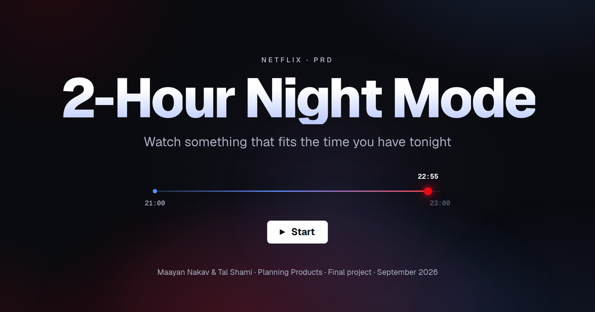

# 2-Hour Night Mode

Interactive presentation of the PRD for **2-Hour Night Mode**, a feature concept for the Netflix TV app: tell us how much time you have tonight, and get options that end inside it.

Planning Products, final project · Maayan Nakav & Tal Shami · September 2026



## What's inside

- 22 slides in six parts: Problem & Goal, Solution, Scope, Requirements, Screens, Learnings
- Six click-open detail panels for questions: decisions, why this size, reach, all 19 requirements, metric definitions, quality and pricing
- Working wireframes: the time picker, the genre filter and the run planner
- One self-contained `index.html`, no build step and no dependencies

## Controls

| Action | Keys |
|---|---|
| Next / previous slide | → ← or Space, or the buttons at the bottom |
| First / last slide | Home / End |
| All slides | E |
| Fullscreen | F |
| Close a detail panel | Esc |
| Link to a slide | add `#s12` to the URL |

## Run locally

Open `index.html` in a browser, or serve the folder:

```bash
python3 -m http.server 8000
```

## Deploy to Vercel

On vercel.com choose Add New → Project, import this repository and click Deploy. Framework preset: Other, no build command, no output directory. Every push to `main` redeploys automatically.

From a terminal in this folder: `npx vercel --prod`

## Files

- `index.html` · the whole presentation
- `favicon.svg`, `og.png` · tab icon and link preview image
- `vercel.json` · clean URLs and basic security headers

The page asks search engines not to index it (`robots noindex` in `index.html`). Delete that line to allow indexing.

---

Student project for a university course. Not affiliated with Netflix.
Built with Claude (Anthropic) as a research and drafting collaborator. Every decision was reviewed and approved by the team.
